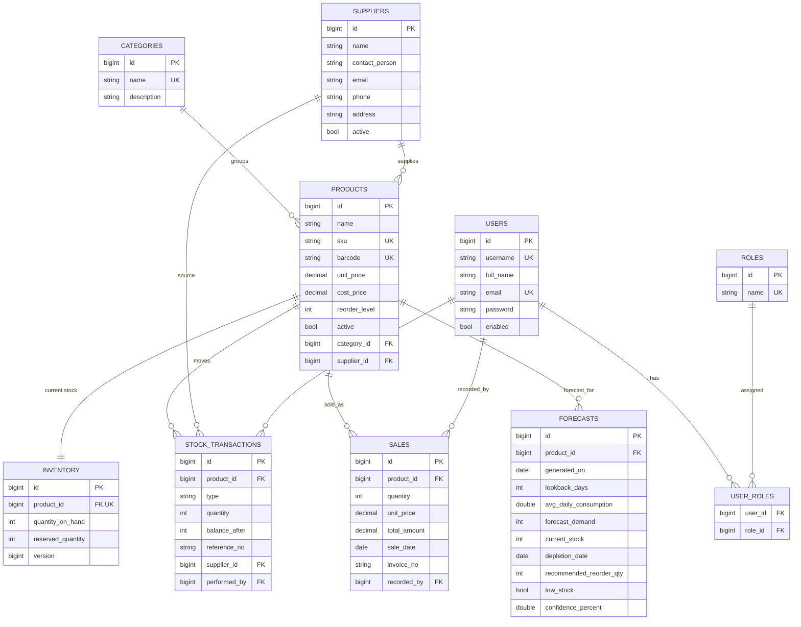

# Entity Relationship Diagram



## Relationship summary

| Relationship | Type | Notes |
|---|---|---|
| Users ↔ Roles | M:N | via `user_roles` join table |
| Category → Products | 1:N | a product belongs to one category |
| Supplier → Products | 1:N | a product has one primary supplier |
| Product ↔ Inventory | 1:1 | live stock level kept separate |
| Product → StockTransactions | 1:N | full movement history |
| Product → Sales | 1:N | demand history (forecast input) |
| Product → Forecasts | 1:N | prediction snapshots over time |
| User → Sales / Transactions | 1:N | audit of who recorded what |
```
